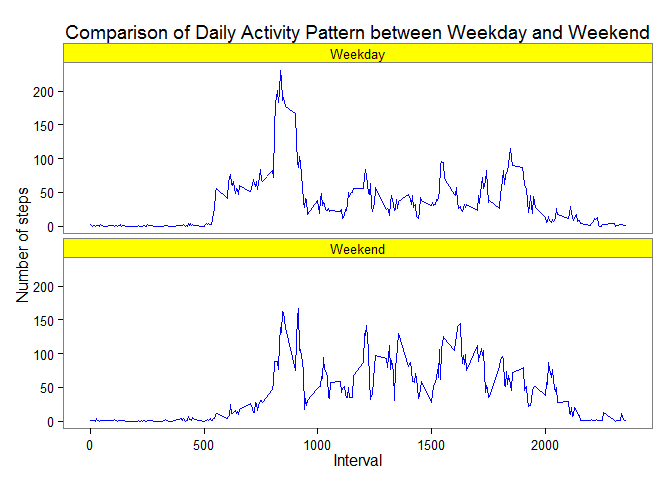

#"Reproducible Research-Assignment 1"

###Loading and preprocessing the data


```r
setwd("C:/Users/Anne-Catherine/Documents/Reproducible Research/RepData_PeerAssessment1/activity")
activity=read.csv("activity.csv")
```

###Mean total number of steps taken per day


```r
library(dplyr)
```

```
## 
## Attaching package: 'dplyr'
## 
## The following object is masked from 'package:stats':
## 
##     filter
## 
## The following objects are masked from 'package:base':
## 
##     intersect, setdiff, setequal, union
```

```r
library(ggplot2)
```

```
## Warning: package 'ggplot2' was built under R version 3.1.2
```

```r
act_sum=summarize(group_by(activity, date), sum=sum(steps, na.rm=TRUE))

g=ggplot(act_sum, aes(c(date), sum))
g+geom_bar(stat="identity", width=0.5)+ylim(0.00, 21200.00)+
    labs(x="Days from October 1st to November 30, 2012")+labs(y="Frequency of steps")+labs(title="Total number of steps taken each day in October & November 2012")
```

 

```r
mean=mean(act_sum$sum)
median=median(act_sum$sum)
```
The mean and median total number of steps taken per day are respectively 9354.2295082 and 10395.

###Average daily activity pattern


```r
activity$interval=factor(activity$interval)
act_int=summarize(group_by(activity, interval), mean=mean(steps, na.rm=TRUE))
act_int$interval= as.character(act_int$interval)
act_int$interval= as.numeric(act_int$interval)
p=ggplot(act_int, aes(interval, mean))
         p+geom_line(linetype=1)+labs(x="5-minute Interval", y="Average number of steps across all days")+labs(title="Average Daily Activity Pattern")
```

 

```r
#qplot(x=c(1:288), mean, data=act_int, geom="line")
#plot(act_int$interval, act_int$mean, type="l", main="Average Daily Activity Pattern", xlab="5-minute Interval", ylab="Average number of steps across all days")

max_mean=act_int[act_int$mean==max(act_int$mean),]
max_int=max_mean[1,1]
```

The 5-minute interval which on average across all the days in the dataset, contains the maximum number of steps is 835.

###Imputing Missing values


```r
mva=sum(is.na(activity$steps))
```

The total number of missing values in the dataset is 2304.

Filling all missing values with the mean of the appropriate interval.


```r
library(data.table)
```

```
## 
## Attaching package: 'data.table'
## 
## The following objects are masked from 'package:dplyr':
## 
##     between, last
```

```r
activity=data.table(activity)
activity$interval=as.character(activity$interval)
act_int=data.table(act_int)
act_int$interval=as.character(act_int$interval)
merge_act=merge(activity, act_int, by="interval")
merge_act$steps[is.na(merge_act$steps)]= merge_act$mean[is.na(merge_act$steps)]
```

Create a new dataset equal to original "activity" dataset with missing values filled.


```r
new_activity=select(merge_act, -(mean))
new_activity$interval=factor(new_activity$interval)
```

Histogram on new activity dataset & report of new mean and median of total number of steps taken per day.


```r
new_act_sum=summarize(group_by(new_activity, date), sum=sum(steps))
g=ggplot(new_act_sum, aes(c(date), sum))
g+geom_bar(stat="identity", width=0.5)+ylim(0.00, 21200.00)+
    labs(x="Days from October 1st to November 30, 2012")+labs(y="Frequency of steps")+labs(title="Total number of steps taken each day in October & November 2012")
```

 

```r
new_mean=mean(new_act_sum$sum)
new_median=median(new_act_sum$sum)
```
The new mean and median total number of steps taken per day are the same, respectively 1.0766189\times 10^{4} and 1.0766189\times 10^{4}. These new values differ from previous mean, 9354.2295082, and median, 10395, without imputation. They increased the estimates of the total daily number of steps.  

###Differences in activity patterns between weekdays and weekends.
Create a new factor: weekday vs. weekend


```r
library(lubridate)
```

```
## Warning: package 'lubridate' was built under R version 3.1.2
```

```
## 
## Attaching package: 'lubridate'
## 
## The following objects are masked from 'package:data.table':
## 
##     hour, mday, month, quarter, wday, week, yday, year
```

```r
activity_diff=mutate(new_activity, weekdays=wday(as.Date(as.character(date)), label=TRUE, abbr=FALSE))
activity_diff$weekdays= as.character(activity_diff$weekdays)
activity_diff$weekdays[activity_diff$weekday %in% c("Monday", "Tuesday", "Wednesday", "Thursday", "Friday")]="Weekday"
activity_diff$weekdays[activity_diff$weekday %in% c("Saturday", "Sunday")]="Weekend"                                                   
activity_diff$weekdays= factor(activity_diff$weekdays)
```

Panel plot comparing weekday vs. weekend activity pattern.


```r
act_diff_by=group_by(activity_diff, interval, weekdays)
act_diff_sum=summarize(act_diff_by, mean=mean(steps))
act_diff_sum$interval=as.character(act_diff_sum$interval)
act_diff_sum$interval=as.numeric(act_diff_sum$interval)
w=ggplot(act_diff_sum, aes(interval, mean))
w+geom_line(colour= "blue")+facet_wrap(~weekdays, ncol=1)+
    labs(x="Interval")+labs(y="Number of steps")+labs(title="Comparison of Daily Activity Pattern between Weekday and Weekend")+theme_bw()+theme(strip.background=element_rect(fill="yellow"))+theme(panel.grid=element_blank())
```

 

The activity patterns do not differ significantly between weekends and weekdays with  a peak between 8 and 10 AM. Activity level seems to be overall higher across the day on weekends than on weekdays.


